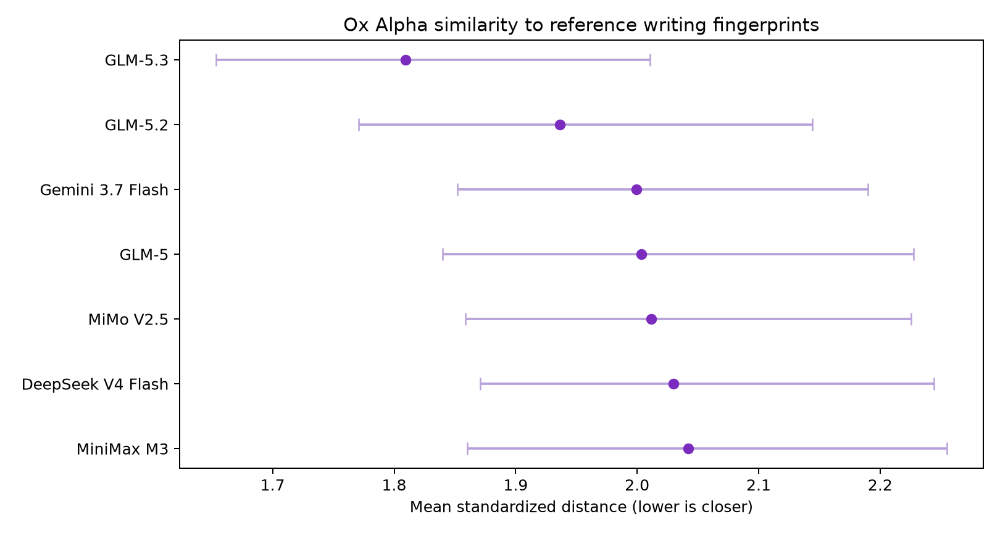

# Ox Alpha stylometry

An exploratory, reproducible writing-fingerprint study of the anonymous
`stealth/ox-alpha` model on OpenRouter.

> **Preliminary result:** Across 11 matched prompts and seven reference models,
> Ox Alpha was closest to GLM 5.3 on all 11 prompts. GLM 5.3 won 100% of 4,000
> prompt-bootstrap resamples. Reference-model leave-one-prompt-out accuracy was
> 72.7%.

This is evidence of stylistic similarity within the tested candidate set. It is
**not proof** that Ox Alpha uses GLM 5.3 weights, nor can it distinguish a base
checkpoint from post-training, a private successor, a system prompt, or a
shared serving stack.



## Result

| Rank | Reference | Mean distance | Bootstrap winner | Prompt votes |
|---:|---|---:|---:|---:|
| 1 | GLM 5.3 | 1.8094 | 100.0% | 11/11 |
| 2 | GLM 5.2 | 1.9363 | 0.0% | 0/11 |
| 3 | Gemini 3.7 Flash | 1.9995 | 0.0% | 0/11 |
| 4 | GLM 5 | 2.0036 | 0.0% | 0/11 |
| 5 | MiMo V2.5 | 2.0116 | 0.0% | 0/11 |
| 6 | DeepSeek V4 Flash | 2.0299 | 0.0% | 0/11 |
| 7 | MiniMax M3 | 2.0423 | 0.0% | 0/11 |

The nearest-reference advantage over GLM 5.2 is about 6.6%. Known GLM 5.3
samples were also classified correctly on all 11 held-out prompts. The complete
screening report is in [`results/report.md`](results/report.md), with per-prompt
distances in [`results/predictions.csv`](results/predictions.csv) and the
reference confusion matrix in [`results/confusion.csv`](results/confusion.csv).

The defensible interpretation is:

> Ox Alpha exhibits GLM-5.3-like writing behavior under this protocol and may be
> GLM-5.3-derived or a closely related checkpoint. Exact model identity remains
> unestablished.

No public GLM 5.4 endpoint was available to test when this collection was made.
The result therefore does not specifically identify Ox Alpha as “GLM 5.4.”

## Dataset

Collection took place through the OpenRouter Chat Completions API on August 25,
2026 (America/Los_Angeles).

| Source ID | OpenRouter model | Role | Outputs |
|---|---|---|---:|
| `glm_5_3` | `z-ai/glm-5.3` | reference | 12 |
| `glm_5_2` | `z-ai/glm-5.2` | reference | 12 |
| `glm_5` | `z-ai/glm-5` | reference | 12 |
| `mimo_v2_5` | `xiaomi/mimo-v2.5` | reference | 12 |
| `deepseek_v4_flash` | `deepseek/deepseek-v4-flash-0731` | reference | 12 |
| `gemini_3_7_flash` | `google/gemini-3.7-flash` | reference | 12 |
| `minimax_m3` | `minimax/minimax-m3:free` | reference | 12 |
| `ox_alpha` | `stealth/ox-alpha` | mystery target | 11 |

Ox Alpha `p12` could not be collected because its sole upstream provider was
repeatedly rate-limited or stalled. Analysis uses the balanced intersection
`p01`–`p11`, yielding 88 analyzed documents. The repository contains all 95
successfully collected final answers; unmatched reference `p12` files remain in
the corpus for auditability but are excluded automatically.

- Prompts: [`prompts.md`](prompts.md)
- Raw final answers: [`data/raw/`](data/raw/)
- Sanitized request metadata: [`data/metadata/`](data/metadata/)
- Collection incidents and deviations: [`experiment_log.md`](experiment_log.md)
- Model manifest: [`manifest.csv`](manifest.csv)

OpenRouter generation IDs have been removed. No API key or reasoning trace is
stored in this repository.

## Method

This project was inspired by
[StoryScope](https://arxiv.org/abs/2604.03136), but it is not a reproduction of
that study. StoryScope uses LLM-assigned narrative features at much larger scale.
This experiment instead uses a deterministic local 460-feature representation:

- 256 hashed character n-grams
- 136 function-word rates
- 23 structural measures
- 21 discourse-marker rates
- 13 punctuation rates
- 11 morphology measures

Features are standardized using reference models only and block-weighted so a
large feature family does not dominate merely by dimensionality. For each
prompt, the reference-model mean is removed to reduce the prompt's main effect.
Each known sample is then classified against source centroids built from all
other prompts. Ox Alpha is never included in feature scaling, prompt means, or
training centroids.

Target uncertainty is summarized with 4,000 prompt-level bootstrap resamples.
The bootstrap measures ranking stability over this prompt set; it does not
account for missing candidate models or prove model lineage.

## Reproduce the analysis

Python 3 and NumPy are required. Matplotlib produces the two figures.

```bash
python3 -m pip install -r requirements.txt
python3 analyze.py validate
python3 analyze.py run
```

Expected screening output:

```text
common prompt IDs       11
Reference accuracy: 72.7%
glm_5_3                 distance=1.8094 bootstrap_win=100.0%
```

`analyze.py run` deterministically rewrites:

- `results/report.md`
- `results/summary.json`
- `results/predictions.csv`
- `results/confusion.csv`
- `results/target_similarity.png`
- `results/rarity_violin.png`

## Reproduce or extend collection

Set an OpenRouter API key in the current shell; never place it in a file:

```bash
export OPENROUTER_API_KEY='your-key-here'
```

Preview or resume Phase 1:

```bash
python3 collect_openrouter.py --phase 1 --all-sources --dry-run
python3 collect_openrouter.py --phase 1 --all-sources --workers 4
```

The collector is resumable, rejects empty final answers, records the returned
model and provider, and applies bounded retries for transient failures. GLM 5.2,
MiMo V2.5, and MiniMax M3 use native/default reasoning because forcing the
gateway's generic High setting produced unreliable empty completions during the
pilot. Other sources request High reasoning and require a provider that supports
the parameter. See [`experiment_log.md`](experiment_log.md) before extending the
dataset.

## Limitations

- This is a screening study with 11 matched prompts, not a preregistered model
  identity benchmark.
- Reference accuracy is moderate (72.7%), and some known controls are frequently
  confused.
- Only one stochastic generation was collected per model/prompt pair.
- Reasoning controls were not identical for every model because provider support
  differed.
- OpenRouter routed several references across multiple inference providers.
- One GLM 5.2 answer was length-limited and retained unchanged.
- Ox Alpha's unavailable `p12` leaves 11 rather than 12 matched Phase-1 prompts.
- The candidate set is incomplete. A closer untested model may exist.
- Writing similarity cannot identify weights, fine-tuning lineage, a system
  prompt, quantization, or post-processing.
- The current finding has not yet been confirmed on the untouched `p13`–`p30`
  prompt set.

## Planned confirmation

The intended next step is to collect `p13`–`p30` for Ox Alpha and the three
leading hypotheses: GLM 5.3, GLM 5.2, and Gemini 3.7 Flash. Those prompts were
written before the Phase-1 result was observed, making them useful as a held-out
confirmation set.

